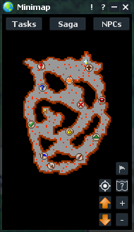

# Simply helper to the game Dragon Ball Legend 

This script is able to attack monsters, recover heal and mana, running on a map, alert if Banner is checking us etc.

## How to use

To run this script you have to run 'main_app.py'.

#### 1. Auto Attack:


* On the right we are able to write monster name. After pressing the button, program start searching given monster.

* Searching monster have to be in monsters folder (2 images: unmarked and marked) e.g. , . Otherwise Auto Attack won't work.

#### 2. Auto Heal and Auto Senzu


* On the right we are able to write number of Health Percent and Mana Percent from 0 to 100. After pressing the button, program start healing or using senzu if is below given percent number.

* ##### important!
```bahs 
Healing is under F3 hotkey!
Senzu is under F11 hotkey!
```

#### 3. Train KI


* If mana is above given Mana Percent then trying burn mana. 
##### important!
```bahs 
Burning mana is under F12 hotkey!
```

#### 4. Antikick


* Character is rotating to the right and then to the left. Repeat is between 500 and 700 seconds.

#### 5. Cavebot


* To create works Cavebot we have to create Marks from mark list on Minimap (Right click on it)


* First waypoint is from the top left (check mark), second is question mark and so on.

* final Minimap with waypoints could be like this:



#### 6. Cast Spell or Heal


* If heal is below given Health Percent then heal yourself otherwise Cast Spell

##### important!
```bahs 
Casting spell is under F1 hotkey!
```

#### 7. MSGcheck


* Searching 


### Used moules 

```bash
tkinter, threading, random, time, winsound, autoit, cv2, PIL, mss, numpy, pyautogui, win32api, keyboard
```